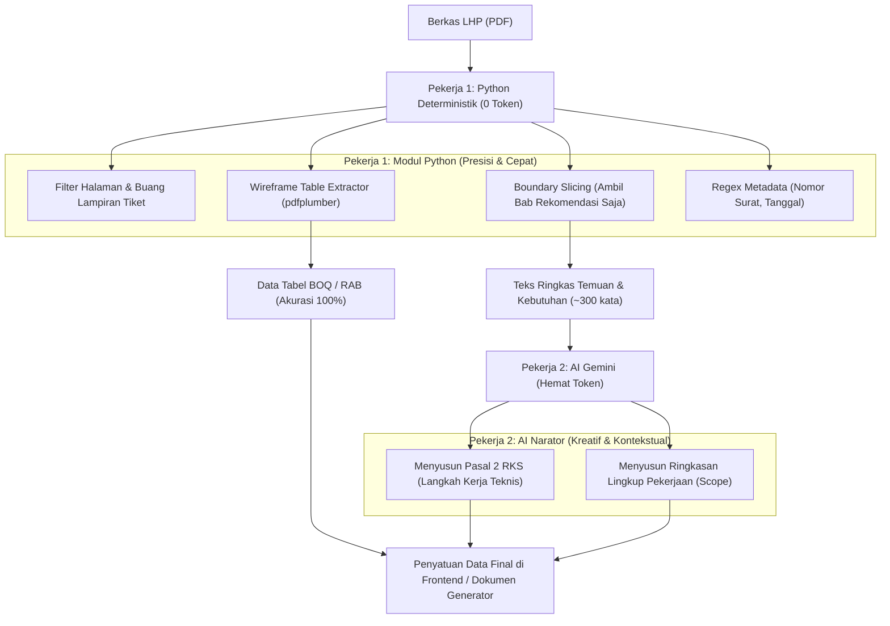

# Rencana Pengembangan: Efisiensi Token & Arsitektur Hybrid Pipeline

**Proyek:** DokumenMaker (LLM-RAB-RKS)  
**Tanggal Pencatatan:** 30 September 2026  
**Status:** Perencanaan & Roadmap Desain Sistem  

---

## 1. Latar Belakang & Masalah (Problem Statement)

Pada implementasi awal, sistem bekerja dengan mengirimkan seluruh teks mentah LHP (*Laporan Hasil Pemeriksaan*) hasil ekstraksi OCR (hingga 12.000 karakter / ~3.000 token) secara langsung ke Google Gemini. 

### Temuan Masalah (Audit Arsitektur Awal):
1. **Pemborosan Token Input:** Dokumen LHP setebal 8 halaman mengandung 70–80% teks administratif yang tidak bernilai bagi AI (seperti tiket ITSM, foto dokumentasi, tanda tangan pejabat, dan log monitoring). Seluruh teks ini terkirim ke LLM secara mentah.
2. **Pemborosan Token Output:** AI diminta membuat format JSON panjang yang berisi baris demi baris tabel item barang (No, Uraian, Volume, Satuan, Harga).
3. **Risiko Halusinasi Angka:** Menyerahkan pembacaan angka dan volume ke LLM rentan terhadap kesalahan ketik, pembulatan salah, atau terlewatnya baris tabel.
4. **Latensi & Biaya Tinggi:** Respons memakan waktu 8–15 detik dengan biaya token yang tidak efisien jika diskalakan ke volume dokumen harian.

---

## 2. Paradigma Baru: Hybrid Pipeline (Deterministik + AI Naratif)

Berdasarkan diskusi dan arahan mentor:
> *"Jangan serahkan pekerjaan kalkulasi dan pembacaan tabel terstruktur kepada LLM yang mahal. Gunakan Python untuk hal-hal deterministik, dan posisikan AI murni sebagai penyusun naskah/narasi yang membutuhkan fleksibilitas bahasa."*

### Mengapa Bukan "Multi-Agent LLM"?
Menggunakan arsitektur Multi-Agent (misal: Agent 1 Ekstraksi $\rightarrow$ Agent 2 Validasi $\rightarrow$ Agent 3 Penulisan) justru **memperparah konsumsi token hingga 2x–3x lipat** karena setiap agent membutuhkan *system prompt* tersendiri serta *context-handoff messages*.

### Arsitektur yang Dipilih: *2-Role Hybrid Pipeline*

---

## 3. Empat Taktik Rekayasa Token Konkret

### Taktik 1: *Boundary / Anchor Slicing* (Pemotongan Berdasarkan Penanda)
* **Konsep:** Dokumen dinas selalu memiliki kata pembuka dan penutup formal.
* **Mekanisme Python:**
  * Titik Awal: Mencari kata kunci seperti `"Untuk mengatasi hal tersebut"` atau `"Rekomendasi"`.
  * Titik Akhir: Berhenti sebelum `"Demikian Berita Acara"` atau `"IT INCIDENT REPORT FORM"`.
* **Efisiensi:** Memangkas teks masukan dari **~3.000 token menjadi hanya ~400–600 token (Hemat ~85%)**.

### Taktik 2: *Table Wireframe Extraction* via `pdfplumber` (0 Token)
* **Konsep:** PDF digital menyimpan koordinat garis geometris (kotak sel).
* **Mekanisme Python:**
  * Menggunakan `pdfplumber` untuk mendeteksi perpotongan garis kisi tabel.
  * Membaca kolom `No`, `Uraian`, `Volume`, dan `Satuan` langsung menjadi list/dictionary Python.
* **Efisiensi:** Biaya ekstraksi tabel = **0 Token**, angka volume dijamin **100% presisi dan anti-halusinasi**.

### Taktik 3: *Pattern Matching via Regex* (Metadata Dokumen)
* **Mekanisme Python:**
  * Nomor LHP: `r"Nomor\s*:\s*([A-Za-z0-9./\-]+)"`
  * Judul Pekerjaan: Mengambil kalimat di bawah frasa `"TENTANG"` atau `"HASIL PEMERIKSAAN ATAS"`.
* **Efisiensi:** 0 Token, waktu eksekusi < 1 milidetik.

### Taktik 4: *Specialized AI Prompting* (Fokus Narasi Pasal 2)
* AI tidak lagi dibebani tugas membaca seluruh file atau menyusun tabel angka.
* **Input ke AI:** Hanya nama pekerjaan dan daftar ringkas kebutuhan material/jasa.
* **Output AI:** Array JSON berisi 3–5 butir kalimat langkah kerja formal RKS (Pembongkaran, Instalasi, Uji Beban, Garansi).
* **Efisiensi:** Konsumsi token output menyusut dari ~1.500 token menjadi **~250 token**.

---

## 4. Analisis Perbandingan: Sebelum vs Sesudah

| Indikator | Arsitektur Awal (Full LLM) | Arsitektur Baru (Hybrid Pipeline) | Dampak Efisiensi |
| :--- | :--- | :--- | :--- |
| **Token Input per Berkas** | ~3.500 - 4.500 token | **~400 - 700 token** | **Turun ~85%** 📉 |
| **Token Output per Berkas** | ~1.500 token | **~250 - 350 token** | **Turun ~75%** 📉 |
| **Waktu Ekstraksi (Latensi)**| 8 - 15 detik | **1 - 3 detik** | **4x - 5x Lebih Cepat** ⚡ |
| **Akurasi Angka RAB** | Rentan salah baca / halusinasi | **100% Deterministik (Sesuai Asli)** | **Zero Error** 🎯 |
| **Estimasi Biaya API** | 100% | **~15% - 20% saja** | **Hemat ~80% Biaya** 💰 |

---

## 5. Rencana Tahapan Eksekusi (Roadmap Implementation)

1. **Sprint 1: Filter Halaman & Pemotongan Teks (*Section Slicing*)**
   - Menambahkan fungsi pembersih teks di `ocr_service.py` untuk mengeliminasi halaman lampiran log tiket IT.
   - Mengambil hanya bab inti "Hasil Pemeriksaan & Rekomendasi".
2. **Sprint 2: Integrasi Parser Tabel `pdfplumber`**
   - Membuat *module* `table_extractor.py` untuk mendeteksi dan mengekstrak tabel BOQ secara langsung dari PDF digital.
   - Menjadikan hasil ekstraksi tabel ini sebagai pengisi otomatis tabel RAB.
3. **Sprint 3: Restrukturisasi Prompt AI Gemini**
   - Mengarahkan prompt Gemini murni untuk menyusun klausul naratif:
     - Butir pekerjaan teknis Pasal 2 RKS.
     - Ringkasan ruang lingkup pekerjaan (*Scope Summary*).
4. **Sprint 4: Pengujian & Komparasi Hasil**
   - Menjalankan uji komparasi antara ekstraksi murni LLM lama vs Hybrid Pipeline baru terhadap sampel dokumen LHP yang sebenarnya.
